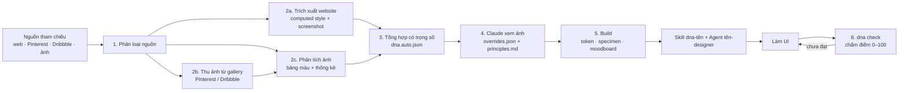

# design-cloner — học “DNA thiết kế” rồi biến nó thành Skill + Agent cho Claude

Đưa vào **website, ảnh chụp màn hình, link showcase (Dribbble/Behance…) hoặc link Pinterest** → bộ công cụ sẽ:

1. **Trích xuất** (tự động, bằng Chromium): màu và vai trò màu, font và thang cỡ chữ, lưới spacing, bo góc, đổ bóng, motion, layout, cách làm button/card/input/nav, ảnh chụp desktop/mobile.
2. **Tổng hợp** tất cả nguồn (có trọng số) thành một **Design DNA** (`dna.json`) kèm token: CSS variables, Tailwind v3/v4, DTCG JSON (dùng cho Figma Tokens/Style Dictionary).
3. **Claude nhìn ảnh** và viết phần DNA định tính (`principles.md`): tinh thần, bố cục, giọng typography, tỉ lệ màu, chi tiết đặc trưng, điều cấm.
4. **Biên dịch** thành một **Skill** (`.claude/skills/dna-<tên>/`) và một **Agent** (`.claude/agents/<tên>-designer.md`) để Claude làm UI đúng phong cách đó.
5. **Kiểm tra**: `dna check` chấm điểm (0–100) mức độ một trang web tuân thủ DNA, kèm lỗi tương phản WCAG và tràn ngang trên mobile, để agent tự sửa đến khi đạt.

Chi tiết từng bước xem mục [Cách hoạt động](#cách-hoạt-động).

## Cách hoạt động



Một DNA có **hai nửa**:

| Nửa | Ai làm | Nội dung |
|---|---|---|
| **Định lượng** | script (`dna` CLI) | màu và vai trò màu, font, thang cỡ chữ, lưới spacing, bo góc, đổ bóng, motion, layout, component |
| **Định tính** | Claude, sau khi *nhìn* ảnh chụp | tinh thần, bố cục, giọng typography, tỉ lệ màu, chi tiết đặc trưng, điều cấm |

Chỉ có số thì UI đúng màu đúng font nhưng vẫn "generic"; chỉ có mô tả thì UI đúng mood nhưng sai chi tiết. Skill sinh ra chứa cả hai.

### Bước 1 — Phân loại nguồn (`src/library.js`)
- URL có đuôi `.png/.jpg/.webp/.gif/.avif` → **ảnh**.
- URL thuộc Pinterest, `pin.it`, Dribbble, Behance, Mobbin, Land-book, Lapa, SiteInspire, Savee, Cosmos, Are.na… → **gallery**.
- URL khác → **website**.
- Đường dẫn trên máy: ảnh → ảnh; `.html` hoặc thư mục có `index.html` → website; thư mục ảnh → mỗi ảnh là một nguồn.
- Tiền tố `web:` / `img:` / `gallery:` để ép kiểu (ví dụ muốn lấy style của chính trang Dribbble).

Mỗi nguồn được lưu vào `dna/<tên>/sources/<id>/` và ghi vào `sources.json` kèm **trọng số** (mặc định 1).

### Bước 2a — Trích xuất website (`src/extract/web.js`, `collect-styles.js`)
1. Mở trang bằng Chromium ở 1440×900, chờ `load` + mạng rảnh + font tải xong.
2. Tự bấm các nút cookie/popup phổ biến ("Accept", "Đồng ý"…), rồi **cuộn hết trang** để kích hoạt lazy-load và animation xuất hiện khi cuộn.
3. Chụp `desktop.png` (màn hình đầu), `full.png` (cả trang, tối đa 9000px) và `mobile.png` (390×844, kèm cỡ chữ body/H1, lề mobile, có tràn ngang không).
4. Chạy một script **bên trong trang**, duyệt tối đa 5000 phần tử đang hiển thị và gom `getComputedStyle` thành histogram:
   - **Màu**: mọi định dạng (`oklch`, `lab`, `color-mix`, tên màu…) được chuẩn hoá qua canvas; màu bán trong suốt được trộn với nền thực phía sau. Màu nền tính theo **diện tích**, màu chữ theo **số ký tự**, màu viền theo **độ dài viền**.
   - **Chữ**: font (lấy font đầu tiên trong stack), cỡ, độ đậm, line-height, letter-spacing (quy ra em), viết hoa; riêng H1–H6 được ghi chi tiết (cỡ, căn lề, màu).
   - **Spacing**: padding, margin (bỏ margin `auto` dùng để căn giữa), `gap` của flex/grid.
   - **Hình khối**: border-radius của các khối có nền/viền/bóng và của ảnh; box-shadow; gradient; `backdrop-filter` (glassmorphism); chữ gradient.
   - **Motion**: thời lượng và easing của transition, số phần tử có animation.
   - **Component** (nhận diện theo heuristic): button (kể cả thẻ `a` trông như nút), input, card (khối 140–820px có nền/viền/bóng chứa chữ), link, nav/header, section full-width (lấy padding dọc), container căn giữa (lấy max-width).
   - **Biến CSS** trên `:root` (ví dụ `--color-primary`), font đã tải, link Google Fonts/Typekit, và các đoạn chữ **không đạt tương phản WCAG**.
5. Phân tích thêm pixel của `desktop.png` (như bước 2c) để bắt được màu từ ảnh, gradient, canvas mà computed style không thấy.

### Bước 2b — Thu ảnh từ gallery (`src/extract/gallery.js`)
Mở trang, cuộn, gom `og:image` và các `` ≥ 180×140px (chọn bản lớn nhất trong `srcset`), **bỏ avatar, logo, icon, ảnh tròn**. Ảnh Pinterest được nâng lên bản 736px. Tải tối đa 12 ảnh (`--limit`) bằng một tab trình duyệt thật (đi qua proxy/cookie như người dùng), rồi phân tích từng ảnh và gộp bảng màu.

### Bước 2c — Phân tích ảnh (`src/extract/image.js`)
Ảnh được giải mã bằng chính Chromium (không cần thư viện native), thu nhỏ còn ~40.000 pixel, rồi:
- **Bảng màu**: lượng tử hoá, chạy **k-means (k=10) trong không gian OKLab** (không gian màu gần với cảm nhận mắt người), gộp các màu gần nhau (ΔE < 0.03) → tối đa 10 màu kèm tỉ lệ.
- **Thống kê mood**: độ sáng trung bình, độ tương phản (độ lệch chuẩn độ sáng), độ bão hoà, tỉ lệ pixel có màu, **khoảng trống** (tỉ lệ màu chiếm ưu thế), **độ rối** (chênh lệch sáng giữa các pixel cạnh nhau), sáng hay tối.

### Bước 3 — Tổng hợp DNA (`src/synthesize.js`)
Dữ liệu của mỗi nguồn được chuẩn hoá về tổng 1 rồi nhân với trọng số của nguồn, sau đó **bỏ phiếu**:

- **Vai trò màu**
  - `background`: màu nền có tổng diện tích lớn nhất. Chế độ sáng/tối suy ra từ độ sáng của nó.
  - `foreground`: màu của **tiêu đề** (không phải màu đoạn văn, thường nhạt hơn) có tương phản ≥ 4.5:1.
  - `surface`: màu nền thứ hai gần với background (màu của card). `muted-foreground`: màu chữ phụ. `border`: màu viền trung tính phổ biến nhất.
  - `primary`: màu có sắc độ (chroma ≥ 0.05) nhận nhiều phiếu nhất. Phiếu đến từ nền button (×3), biến CSS tên `primary/brand` (×4) hoặc `accent/cta/link` (×2), link, chữ và nền có màu, bảng màu screenshot, màu trong gradient. Không có màu nào đủ đậm → DNA **monochrome** (nút dùng màu chữ).
  - `accent`: màu có sắc độ tiếp theo, lệch hue ≥ 25° so với primary.
  - `primary-foreground`: lấy màu chữ **thật** trên nút primary; nếu không có thì chọn trắng/đen theo tương phản.
  - `success / warning / danger`: tự sinh cùng độ sáng và độ bão hoà với primary để hài hoà.
  - **Ramp 50–950** cho primary/accent sinh trong OKLCH, giữ nguyên hue và đặt đúng màu gốc vào bậc gần nhất; ramp neutral pha nhẹ sắc của nền.
  - Nhận xét tự động: độ bão hoà (monochrome/muted/balanced/vivid), độ tương phản, nóng/lạnh, phối màu (đơn sắc, tương đồng, bổ túc…).
- **Typography**
  - Font **body** = font nhiều ký tự nhất ở cỡ 13–20px. Font **display** = font của tiêu đề ≥ 26px. Font **ui** = font của button/nhãn nếu khác (ví dụ tạp chí dùng serif cho bài, sans viết hoa cho nhãn). Font **mono** nếu có.
  - Mỗi font được xác định: Google Font / font hệ thống / font riêng; font thương mại (Söhne, Circular, GT Walsheim…) được gợi ý **font Google thay thế gần nhất**.
  - **Thang cỡ chữ**: gom các cỡ chênh nhau < 4.5%, giữ cỡ quan trọng, đặt tên `xs … 9xl` quanh cỡ `base`, ước lượng tỉ lệ (major third, perfect fourth…).
  - Thông số H1/H2/H3 (cỡ, độ đậm, line-height, tracking, viết hoa, căn lề), body, và **nhãn "eyebrow"** (chữ nhỏ viết hoa giãn chữ phía trên tiêu đề).
- **Spacing**: histogram padding + margin (×0.7) + gap (×1.5). Nếu ≥ 55% giá trị chia hết cho 8 thì **lưới 8px**, ngược lại lưới 4px. Thang spacing = các giá trị phổ biến nhất (đã làm tròn theo lưới). Thêm padding dọc của section, độ rộng container, lề mobile và **mật độ** (thoáng/cân bằng/dày đặc).
- **Hình khối & chiều sâu**: các bậc bo góc `sm/md/lg/xl`, nút dạng pill hay không, phong cách (sharp/soft/rounded/very-rounded/pill); tối đa 3 box-shadow phổ biến sắp theo độ blur → `sm/md/lg`; các bề mặt được tách bằng **viền**, **bóng** hay **khối màu**.
- **Layout, motion, hiệu ứng**: hero căn giữa hay trái, số cột grid ưa dùng, kiểu nav (glass/trong suốt/đặc, sticky), độ dài trang; thời lượng và easing phổ biến; glassmorphism, gradient, chữ gradient, cách dùng ảnh.
- **Component**: với button primary/secondary, card, input, link lấy **kiểu xuất hiện nhiều nhất**, rồi đổi màu thô sang tên vai trò (`primary`, `surface`…) để công thức dùng được với token.
- **Từ khoá tính cách**: suy ra từ các số trên (ví dụ `dark-mode, vibrant, glassmorphism, pill buttons` hoặc `editorial, sharp corners, flat`). Phần nào chỉ đoán từ ảnh (độ tin cậy thấp) thì không sinh từ khoá.

Kết quả ghi vào `dna.auto.json`.

### Bước 4 — Claude xem ảnh và bổ sung (skill `design-dna`)
Claude đọc `moodboard.png`, các screenshot và `specimen.png`, rồi:
- Sửa số liệu sai vào **`overrides.json`** (được deep-merge lên DNA). Ví dụ: nguồn chỉ có ảnh nên typography chỉ là placeholder, cần nhận diện font bằng mắt; hoặc màu của một bức ảnh lớn bị chọn nhầm làm primary. Khi đổi `primary`/`accent`/`background` thì ramp và màu chữ trên nút được **tính lại tự động**; khi đổi tên font thì thông tin font và link Google Fonts cũng được tính lại.
- Viết **`principles.md`** theo `references/principles-guide.md`: chỉ ghi điều **quan sát và kiểm chứng được** (số đo, vị trí, tỉ lệ), đặc biệt là *Signature details* và *Anti-patterns*.

### Bước 5 — Build (`dna build`)
- `dna.json` = `dna.auto.json` + `overrides.json`.
- Sinh token: `tokens.css` (biến CSS + `@import` Google Fonts), `tailwind-v4.css` (`@theme`), `tailwind.preset.js` (Tailwind v3), `tokens.json` (chuẩn DTCG), `components.css` (`.btn`, `.card`, `.input`, `.nav`, `.eyebrow`, `.container`, `.section`… dựng từ công thức component).
- `specimen.html/.png`: style guide và một landing mẫu **chỉ dùng token** → đặt cạnh ảnh gốc để thấy DNA đã giống chưa. `moodboard.png`: toàn bộ ảnh tham chiếu kèm bảng màu.
- **Skill** `.claude/skills/dna-<tên>/`: `SKILL.md` gồm quy trình 5 bước, principles, luật **Do/Don't tự sinh từ số liệu** (ví dụ "Nút CTA màu `foreground`, không dùng màu brand", "Chỉ dùng cỡ chữ 12, 13, 18, 22, 28, 40, 88px", "Không đổ bóng"), bảng token, cùng các file token và ảnh tham chiếu trong `references/`.
- **Agent** `.claude/agents/<tên>-designer.md`: một designer + front-end engineer bắt buộc đọc skill và xem ảnh tham chiếu trước khi code, chỉ dùng token, rồi lặp vòng *chụp màn hình → so với ảnh gốc → `dna check` → sửa* cho đến khi đạt.

### Bước 6 — Chấm điểm (`dna check`, `src/check.js`)
Trang cần kiểm tra được trích xuất giống bước 2a, rồi so với DNA theo từng hạng mục có trọng số:

| Hạng mục | Trọng số | Đạt khi |
|---|---|---|
| Nền trang & chế độ sáng/tối | 2 | nền trang gần `background`/`surface` (ΔE < 0.03) |
| Màu nền / màu chữ | 2 / 2 | màu nằm trong vai trò, ramp hoặc bảng màu (ΔE ≤ 0.045) |
| Màu viền | 0.5 | như trên |
| Font | 2 | thuộc các font của DNA (hoặc font thay thế) |
| Cỡ chữ | 1.5 | nằm trên thang (±1px) |
| Bo góc | 1 | nằm trên thang (±2px) hoặc pill |
| Spacing | 1 | nằm trên thang hoặc chia hết cho lưới |
| Đổ bóng | 0.5 | là một shadow token |

Điểm tổng 0–100 (mục tiêu ≥ 85), mỗi hạng mục liệt kê **phần tử vi phạm kèm selector**, cộng thêm danh sách lỗi tương phản WCAG AA và kiểm tra tràn ngang ở mobile 390px. Báo cáo lưu ở `report.md` cạnh các screenshot.

## Cài đặt

```bash
npm install
npx playwright install chromium   # nếu máy chưa có Chromium cho Playwright
npm link                          # (tuỳ chọn) để gõ `dna` thay cho `node bin/dna.js`
npm test
```

## Dùng nhanh (qua Claude Code — khuyến nghị)

Mở Claude Code trong thư mục này rồi nói, ví dụ:

> Học phong cách từ https://linear.app, https://www.pinterest.com/pin/123… và ./inspo/*.png, đặt tên `midnight`.

Skill `design-dna` (hoặc agent `dna-analyst`) sẽ chạy trích xuất, xem ảnh, sửa số liệu, viết principles và sinh skill `dna-midnight` + agent `midnight-designer`. Sau đó:

> Dùng midnight-designer làm landing page cho app quản lý chi tiêu.

## Dùng bằng CLI

```bash
node bin/dna.js learn midnight https://linear.app ./inspo/ https://www.pinterest.com/pin/123/
node bin/dna.js add midnight https://dribbble.com/shots/456 --weight 0.5   # thêm nguồn
node bin/dna.js build midnight                 # sau khi sửa principles.md / overrides.json
node bin/dna.js show midnight                  # xem tóm tắt DNA
node bin/dna.js check midnight http://localhost:3000   # chấm điểm trang của bạn
node bin/dna.js build midnight --claude-dir ~/.claude  # cài skill/agent cho MỌI dự án
```

| Nguồn | Cách xử lý |
|---|---|
| URL website | computed style của mọi phần tử + screenshot desktop / full page / mobile |
| Pinterest pin/board, Dribbble, Behance, Land-book, Mobbin… | tải ảnh được showcase (bỏ qua avatar/logo), phân tích bảng màu & độ “thoáng” |
| Ảnh local / thư mục ảnh | phân tích bảng màu (k-means trong OKLab), độ sáng, độ bão hoà, khoảng trống |
| File `.html` / thư mục có `index.html` | như website |
| Tiền tố `web:` `img:` `gallery:` | ép kiểu nguồn |

Pinterest/Dribbble đôi khi chặn bot hoặc bắt đăng nhập — khi đó hãy lưu ảnh về máy và truyền file.

### Trộn nhiều nguồn
Mỗi nguồn có trọng số (`--weight`, hoặc sửa `dna/<tên>/sources.json` rồi `dna synth <tên> && dna build <tên>`). Công thức hay dùng: 1 website làm “khung” typography/layout (weight 2) + vài ảnh Pinterest cho mood và bảng màu.

## Một DNA gồm những gì

```
dna/<tên>/
  sources/<id>/        desktop.png, full.png, mobile.png, raw.json | images/, analysis.json
  dna.auto.json        DNA do máy tổng hợp
  overrides.json       (tuỳ chọn) sửa tay — deep-merge lên dna.auto.json
  principles.md        DNA định tính do Claude viết sau khi xem ảnh
  dna.json             DNA cuối cùng (auto + overrides)
  DNA.md               tóm tắt dễ đọc
  tokens.css  components.css  tailwind-v4.css  tailwind.preset.js  tokens.json
  specimen.html/.png   style guide + landing mẫu dựng CHỈ từ token (để so với ảnh gốc)
  moodboard.html/.png  toàn bộ ảnh tham chiếu + bảng màu
```

Token dùng tên theo chuẩn shadcn/Tailwind v4 (`--color-background`, `--color-primary`, `--color-muted-foreground`, `--font-display`, `--text-2xl`, `--radius-md`, `--shadow-md`…) nên **đổi DNA = đổi file token**, markup giữ nguyên.

Ví dụ đầu ra có sẵn trong [`examples/output/paper`](examples/output/paper) (SKILL.md, agent, specimen, moodboard) và [`examples/output/aurora`](examples/output/aurora). Tự tạo lại bằng `npm run demo`.

## Cấu trúc mã nguồn

```
bin/dna.js                    CLI
src/extract/collect-styles.js chạy trong trang: gom computed style thành histogram
src/extract/web.js            website → screenshot + raw.json
src/extract/gallery.js        Pinterest / Dribbble / showcase → tải ảnh
src/extract/image.js          phân tích pixel (bảng màu, sáng tối, khoảng trống, độ rối)
src/synthesize.js             bỏ phiếu có trọng số → vai trò màu, thang chữ, spacing, shape, component…
src/generate/tokens.js        CSS vars, Tailwind v3/v4, DTCG, components.css
src/generate/docs.js          DNA.md, principles template, SKILL.md, agent
src/generate/pages.js         specimen + moodboard
src/check.js                  chấm điểm tuân thủ DNA
.claude/skills/design-dna/    skill điều phối quy trình (dành cho Claude)
.claude/agents/dna-analyst.md agent chuyên chưng cất DNA
```

## Giới hạn
- Font thương mại (Söhne, Circular, GT…) được thay bằng font Google gần nhất; tên font gốc vẫn được ghi lại.
- Nguồn chỉ có ảnh thì typography là placeholder (`confidence: low`) — Claude cần nhận diện font bằng mắt và ghi vào `overrides.json`.
- Trang dựng bằng canvas/WebGL chỉ lấy được bảng màu từ screenshot, không lấy được style.
- Chỉ nên học phong cách (DNA) để làm sản phẩm của bạn; đừng sao chép nguyên logo, nội dung hay tài sản có bản quyền.
